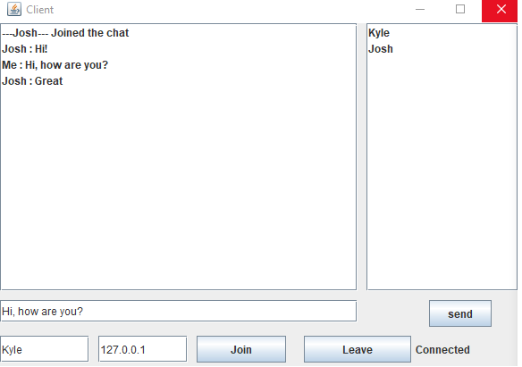

# Introduction
This is a simple chat application developed as a university assignment. The application is written in Java and provides a basic text-based chat interface for communication between multiple users. It uses sockets for network communication, allowing users to connect to a central server and exchange messages in real-time.

# Features
* Multi-User Chat: The application supports multiple users connecting to a central server and participating in group chats.
* Real-Time Messaging: Messages are sent and received in real-time, allowing users to have interactive conversations.
* Usernames: Users can set their usernames when they connect to the server, making it easy to identify who is sending each message.
* Informes all users when a user logins/logsout
* Shows lists of all connected users 
* Uses Threads and TCP for multiple connections to the server

### UI

